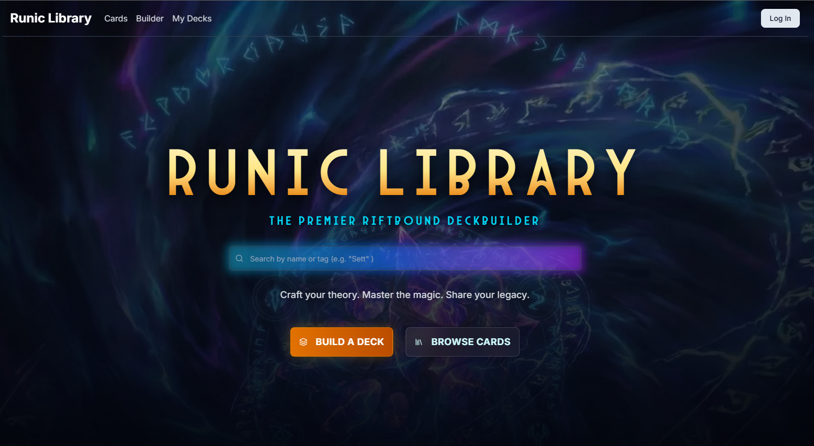
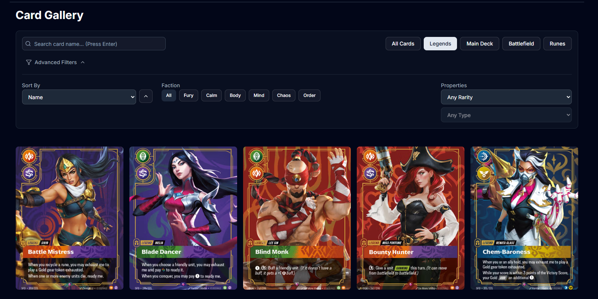
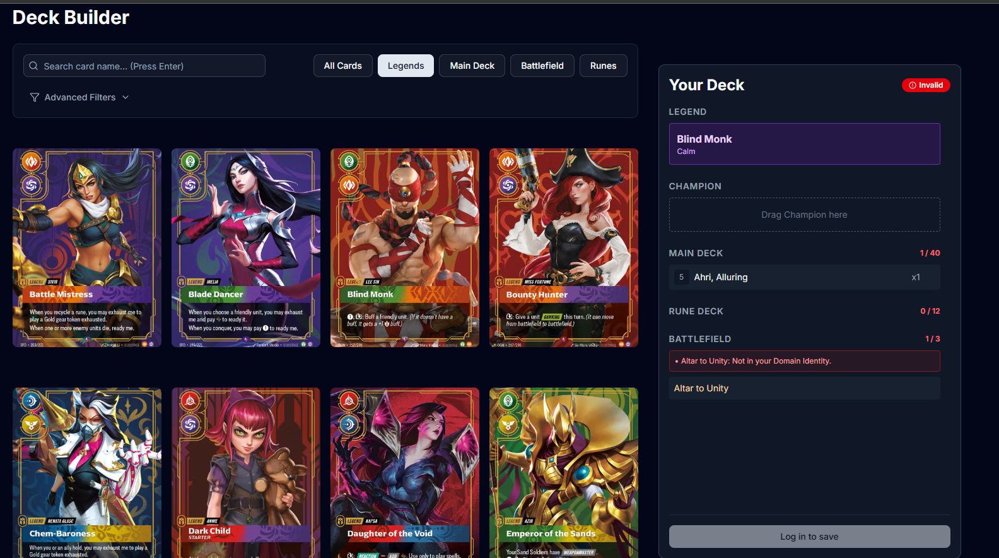

# Runic Library

**A deck builder and card database for the Riftbound trading card game.**

[](https://runiclibrary.com/)




> **Status:** working prototype. It currently runs on a self-compiled card dataset while I wait for approval of my Riot Games API access (see [Data & legal](#data--legal)).

---

## About

Runic Library lets Riftbound players browse every card, filter by faction, rarity and type, and build tournament-legal decks with drag & drop. The deck is checked against the official construction rules in real time.

I built it solo, from scratch, without following a tutorial. I had two goals: to grow as a full-stack developer, and to build something I would actually use as a TCG player (Magic: The Gathering, Riftbound). I chose Riftbound because it is newer and more niche than MTG, so the tooling around it is still thin.

**My role:** concept, UX/UI design, front end, back end, database design, CI/CD and deployment.

## Features

- **Card gallery:** search, sorting, quick category tabs (Legends, Main Deck, Battlefield, Runes) and advanced filters for faction, rarity and type
- **Card detail pages:** every card has its own route (`/cards/[cardId]`)
- **Deck builder with drag & drop:** pick a Legend, then drag cards into the Champion, Main Deck, Rune Deck and Battlefield zones
- **Live rule validation:** the deck is checked on every change, and violations are shown inline next to the affected card
- **Accounts and saved decks:** sign in with Firebase Auth, then save and revisit decks under *My Decks*
- **Global quick search:** debounced name search from the landing page

| Card Gallery | Deck Builder |
| --- | --- |
|  |  |

### Deck validation rules

The builder enforces Riftbound's deck construction rules, all in one memoized validation pass in `DeckBuilderContext`:

| Rule | Constraint |
| --- | --- |
| Legend | Exactly 1. It defines the deck's **Domain Identity** |
| Main deck | Exactly 40 cards, max. 3 copies per card |
| Signature cards | Max. 3, and they must match the Legend's champion |
| Rune deck | Exactly 12 runes |
| Battlefields | Exactly 3, no duplicates |
| Domain Identity | Every card must belong to the Legend's domains |

## Tech stack

| Layer | Technology |
| --- | --- |
| Framework | Next.js 16 (App Router, Route Handlers), React 19 with React Compiler |
| Language | TypeScript |
| UI | Tailwind CSS 4, Radix UI / shadcn/ui, Lucide icons |
| Drag & drop | dnd-kit |
| Database | Neon (serverless PostgreSQL) with Drizzle ORM |
| Auth | Firebase Authentication. Server-side token verification with Firebase Admin SDK |
| Testing | Vitest: unit tests for deck validation and filter parsing, route tests for the decks API |
| Hosting | Vercel |
| CI/CD | GitHub Actions: lint, test and build checks, plus an automatic Neon database branch for each pull request |

## Architecture & decisions

```
Browser (React 19)
  ├── Firebase Auth (client SDK) ──► ID token
  └── fetch /api/*  (Bearer token)
        │
Next.js Route Handlers (Vercel)
  ├── Firebase Admin: verifyIdToken()
  └── Drizzle ORM ──► Neon Postgres  (cards · users · decks · deck_cards)
```

- **Neon + Drizzle for the card data.** Cards are highly structured, relational data that need fast filtering. Postgres is the natural fit, and Neon is part of the Vercel / Next.js ecosystem. Drizzle adds a type-safe schema that lives in the codebase.
- **Firebase for authentication.** I wanted identity handled separately from the card data. I also have the most experience with Firebase Auth. The API verifies each request's ID token on the server, so user data is scoped to the Firebase UID.
- **A database branch per pull request.** A GitHub Actions workflow creates a separate Neon branch for every PR and deletes it again on close. Schema changes can be tested without touching production data.

## Challenges

- **Making drag & drop easy to learn.** The hard part was not the drag logic but the UX: users need to understand *where* a card can go and *why* it is rejected. I solved this with labelled drop zones (e.g. "Drag Champion here"), per-zone counters (`1 / 40`), a global *Valid / Invalid* badge, and inline error messages right next to the card that breaks a rule.
- **Building the dataset myself.** Without official API access, I researched and structured all card data by hand (factions, types, tags, signature cards) to match Riot's data model as closely as possible. That way, switching to the official API later only means swapping the data source.
- **Encoding the game rules.** Rules like Domain Identity and signature-to-champion matching depend on card tags. I had to normalize the data so the validation logic stays readable and testable.

## Accessibility

Color contrast was considered throughout the dark theme, and the UI is built on Radix primitives, which come with keyboard and ARIA support. Further work is planned (see roadmap). Accessibility (WCAG / BITV) is a core part of my professional background, so this is a priority for me.

## Roadmap

- [ ] Switch to the official Riot Games API once access is approved
- [ ] Accessibility pass: keyboard alternative to drag & drop, screen-reader announcements for validation changes, a full WCAG 2.2 AA audit
- [ ] Sharing public decks (the data model already supports `public` / `private` visibility)
- [ ] Deck import / export
- [x] Unit tests for the validation logic

## Getting started

```bash
git clone https://github.com/MerlinSleeps/runic-library.git
cd runic-library
npm install
npm run seed:sql   # seed the card table (requires .env.local, see below)
npm run dev
npm test           # run the unit tests
```

Create a `.env.local` with your Neon and Firebase credentials:

```
DATABASE_URL=
NEXT_PUBLIC_FIREBASE_API_KEY=
NEXT_PUBLIC_FIREBASE_AUTH_DOMAIN=
NEXT_PUBLIC_FIREBASE_PROJECT_ID=
FIREBASE_PROJECT_ID=
FIREBASE_CLIENT_EMAIL=
FIREBASE_PRIVATE_KEY=
```

## Data & legal

Runic Library is a non-commercial fan project for personal and portfolio use. It is not endorsed by Riot Games and does not reflect the views or opinions of Riot Games or anyone officially involved in producing or managing Riot Games properties. Riot Games and all associated properties are trademarks or registered trademarks of Riot Games, Inc.

The card data is currently a self-compiled dataset. Official API access has been requested and is pending verification.

## Contact

Built by **Merlin** · [GitHub](https://github.com/MerlinSleeps)
